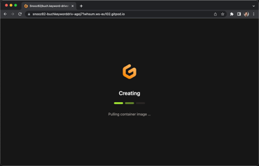
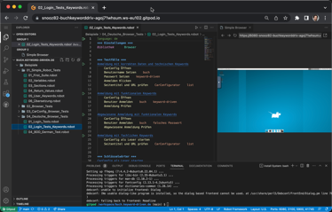

# Beispiele aus dem Buch "Keyword-Driven Testing"
(Matthias Daigl & René Rohner)

In diesem GitHub-Repository finden Sie exemplarische Testfälle des Robot Frameworks, die Sie selbst ausprobieren können.

Das Projekt ist so konzipiert, dass Sie die Tests ohne vorherige Installation des Robot Frameworks oder Python auf Ihrem Computer problemlos online durchführen können.

Für diese Zwecke nutzen wir Gitpod.io, eine cloudbasierte Entwicklungsumgebung, die Sie per Knopfdruck erstellen und anschließend verwerfen können.

Die einzige Voraussetzung hierfür ist ein GitHub-Konto. Mit Ihrem GitHub-Konto können Sie Gitpod.io für 50 Stunden pro Monat kostenfrei nutzen.

## Beispiele

Im Ordner "Beispiele" finden Sie Test-Suiten des Robot Frameworks, die von sehr einfachen bis hin zu strukturierten Testsuiten auf Deutsch mit realen Webtests zeigen, wie das Robot Framework in der Praxis funktioniert.

## Nutzung von Gitpod.io

Wenn Sie dieses Projekt in Gitpod öffnen, werden Sie zunächst dazu aufgefordert, sich mit Ihrem GitHub-Konto zu authentifizieren. Anschließend wählen Sie die Konfiguration der Umgebung aus. Üblicherweise können Sie die Standardeinstellungen beibehalten.

### Start der Umgebung und Installation der Pakete

Die Umgebung wird in einem Container in der Cloud initialisiert und Sie erhalten Zugriff über Ihren Browser.

Bitte warten Sie, bis die Initialisierung vollständig abgeschlossen ist.

**!! Es werden keine Daten auf Ihrem Computer gespeichert!!**

|  |
|:-:|
| Gitpod wird geladen. |

|  |
| :-: |
| Gitpod ist fertig initialisiert |

## Ausführung von Tests und Öffnen der VNC-Sitzung

In der geladenen Visual Studio Code-Umgebung können Sie einerseits im "Explorer"-Reiter (📄 Symbol links) die Robot Framework-Dateien öffnen und die Tests über den Play-Button in der Suite starten, oder im "Testing"-Reiter (Reagenzglas-Symbol links) alle Tests sehen.

|  |
| :-: |
| Gitpod ist fertig initialisiert |

Unten haben Sie im "Terminal"-Reiter Zugriff auf die Kommandozeile des Linux-Systems.

Im "Ports"-Reiter können Sie durch Klicken auf die Weltkugel in der Zeile des Ports 6080 in einem neuen Browser-Tab auf den Desktop zugreifen und den automatisierten Browser dort sehen.

Nach Ausführung der Tests wird automatisch die log.html in VSCode geöffnet.

## Lokale Installation

Um alle Tests durchführen zu können, benötigen Sie Python 3.8 oder neuer sowie NodeJS 16 oder neuer.

### Installation

Installieren Sie alle benötigten bzw. empfohlenen Pakete mit den folgenden Befehlen im Projektordner:

    pip install -U -r requirements.txt

Initialisieren Sie anschließend die [Browser-Bibliothek](https://robotframework-browser.org):

    rfbrowser init

Jetzt sollten Sie startklar sein.

Wir empfehlen die Nutzung von [Visual Studio Code](https://code.visualstudio.com) und des Plugins [Robot Code](https://github.com/d-biehl/robotcode).

# Links aus dem Buch

* [RobotCode by Daniel Biehl.](https://github.com/d-biehl/robotcode)
* [Trends in Testing 2010 - Testautomatisierung out-of-the-box! Vortrag 2: TA-Architektur.](https://www.imbus.de/downloads)
* [Editor für Robot Framework.](https://github.com/robotframework/RIDE)
* [Design and code inspections to reduce errors in program development.](http://www.mfagan.com/pdfs/ibmfagan.pdf)
* [Python Software Foundation. Python Package Index.](https://pypi.org)
* [Robot Framework Foundation. Robot Framework Foundation Website.](https://robotframework.org/foundation/)
* [Robot Framework Foundation. Robot Framework Manual.](https://robotframework.org/robotframework/#user-guide)
* [Robot Framework Foundation. Robot Framework Project.](https://github.com/robotframework/robotframework)
* [Robot Framework Foundation. Robot Framework Website.](https://robotframework.org)
* [Martin Fowler. DSL Guide.](https://www.martinfowler.com/dsl.html)
* [Martin Fowler. PageObject.](https://martinfowler.com/bliki/PageObject.html)
* [imbus AG. Glossar.](http://www.imbus.de/glossar/)
* [imbus AG. Kriterienkatalog zur Toolauswahl.](https://www.imbus.de/downloads/basiswissen-softwaretest)
* [imbus AG. QS-Tag 2008 Archiv.](https://www.qs-tag.de/en/archiv/archiv-ansicht/qs-tag-2008)
* [RoboCorp Inc. Robot Framework Language Server.](https://marketplace.visualstudio.com/items?itemName=robocorp.robotframework-lsp)
* [Open Source Initiative. Open Source Initiative – Open Source Definition.](https://opensource.org/osd)
* [ISO/IEC/IEEE/PMI. SE-VOCAB.](http://pascal.computer.org/sev_display/index.action)
* [ISTQB® Foundation Level Model-Based Tester.](https://www.istqb.org/certification-path-root/model-based-tester.html)
* [ISTQB® Certified Tester Advanced Level Syllabus.](http://www.istqb.org/downloads/syllabi/advanced-level-syllabus.html)
* [ISTQB® Certified Tester Advanced Level Test Automation Engineer Syllabus.](https://www.istqb.org/downloads/category/48-advanced-level-test-automation-engineer-documents.html)
* [ISTQB®. Online-Glossar.](http://glossary.istqb.org)
* [Master Thesis Pekka Laukkanen.](http://eliga.fi/Thesis-Pekka-Laukkanen.pdf)
* [Microsoft. Playwright Website.](https://playwright.dev/)
* [Microsoft. Visual Studio Code Website.](https://code.visualstudio.com)
* [Robot Framework Browser Library.](https://robotframework-browser.org)
* [René Rohner. Ressourcen zu Keyword-Driven Testing.](http://www.buch.keyword-driven.de)
* [Webshop des Beuth Verlags.](https://www.beuth.de/de/norm/iso-iec-ieee-29119-5/266302684)
* [WebDriver Spezifikation bei W3C.](https://www.w3.org/TR/webdriver/)
* [Wikipedia: Modell.](https://de.wikipedia.org/wiki/Modell)
